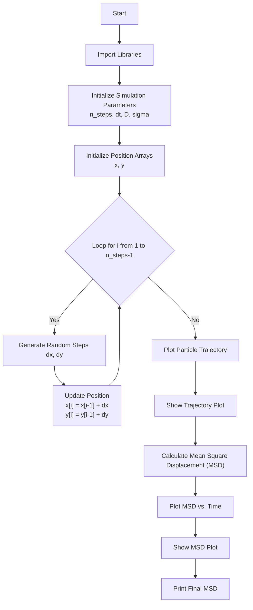

```mermaid
graph TD
    A[Start] --> B[Import Libraries];
    B --> C[Initialize Simulation Parameters<br>n_steps, dt, D, sigma];
    C --> D[Initialize Position Arrays<br>x, y];
    D --> E{Loop for i from 1 to n_steps-1};
    E -- Yes --> F[Generate Random Steps dx, dy];
    F --> G["Update Position<br>x[i] = x[i-1] + dx<br>y[i] = y[i-1] + dy"];
    G --> E;
    E -- No --> H[Plot Particle Trajectory];
    H --> I[Show Trajectory Plot];
    I --> J["Calculate Mean Square Displacement (MSD)"];
    J --> K["Plot MSD vs. Time"];
    K --> L[Show MSD Plot];
    L --> M[Print Final MSD];
```
